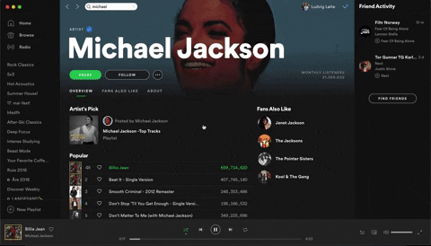

# Lyrics-Finder

AppleScript made for use with [Alfred](https://www.alfredapp.com/) and [Spotify](https://www.spotify.com/)

## How to use
1. Open Alfred. In my case *option* + *space*
2. Type *lyrics* and press enter
3. Safari will now open and show you the lyrics

## How it works
This is a very basic/"manual" script. It does the following:
1. Use Spotify API to get current artist and current track
2. Open safari
3. Open [Genius](https://www.genius.com) and search for current track.
   - I found that this could be done by entering the URL *"http://genius.com/search?q="* + *track_name* + *" "* + *track_artist*
4. Simulate a click on the most popular result.
5. Simulate *cmd* + *shift* + *r* to get into *reading view*

## Potential improvements
1. Automated scroll so that it follows the Lyrics. 
   - It may be possible to do this simply by comparing length of the song and length of lyrics, and then setting a fixed scroll speed.
